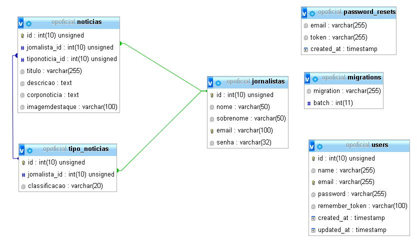

# Projeto OPOficial

Objetivo de criar uma api para consumo de notícias 

## Softwares utilizados

FrameWork Laravel 
Visual Studio Code: Configurado repositório Git local e Remoto(GitHub)
Xammp:  (PHP e Mysql) Ajuste da máquina virtual
Insomnia: Teste de saidas JSON

## Modelagem
